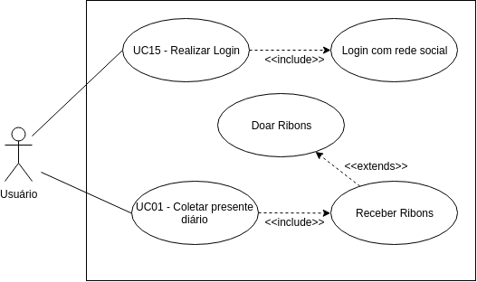

| Data       | Versão  | Descrição       | Autor            |
| ---------- | ------- | --------------- | ---------------- |
| 24/04/2019 | [1.0](https://github.com/requisitos-2019-1/Ribon/commit/10c1ade00b0373b9e69c8cfa5dbf3555ae709272) | Criação do UC01 | Victor Rodrigues |
| 24/04/2019 | [1.1](https://github.com/requisitos-2019-1/Ribon/commit/4e851f84f065d4f90f8a9c4c23f1a9421f7c7bb4) | Adicão o diagrama 1 e pré condição | Victor Rodrigues |

# UC01: Coletar ribon diário

## Diagramas
 Versão 1.

## 1. Descrição
Usuário coleta um bonus de moedas ribon.

## 2. Descrição dos atores

### 2.1. Usuário

## 3. Pré-condição
- Usuário deve estar com app aberto.
- Usuário não pode ter coletado o presente diário no mesmo dia.

## 4. Fluxo básico de eventos
1. O caso de uso ccomeça quando o usuário abre o app.
2. Usuário é apresentado a tela de histórias.
3. Usuário seleciona ícone de presente.
4. O caso de uso termina.

## 5. Fluxo alternativo
Caso o usuário não esteja na tela de histórias, o usuário ainda pode coletar o presente diário, desde que esteja em uma das três paginas seguintes: Doações, Comunidade ou Perfil.

## 6. Cenário chave

- [Cenário 001 - Coletar Ribon Diário](https://github.com/requisitos-2019-1/Ribon/blob/master/Modelagem%20de%20Requisitos/Cenarios/Coletar_ribon_diario.md)

## 7. Pós-condição
- Usuário recebe a quantia de ribons correspondente ao presente diário.
