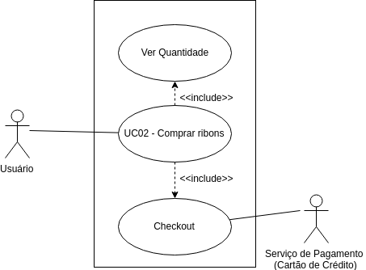

| Data       | Versão  | Descrição       | Autor            |
| ---------- | ------- | --------------- | ---------------- |
| 24/04/2019 | [1.0](https://github.com/requisitos-2019-1/Ribon/commit/f581c3cd0aa6b6b92bb7f8d4c6f2e39a961a4eda) | Criação do UC02 | Victor Rodrigues |
| 24/04/2019 | [1.1](https://github.com/requisitos-2019-1/Ribon/commit/63348d2de351448d4ce2b9dca6f109ed9ae8098f) | Adicionando ator e fluxo | Victor Rodrigues |
| 24/04/2019 | [1.2]() | Adicionando diagrama v1 | Victor Rodrigues |

# UC02: Comprar ribons

## Diagramas
 Versão 1.

## 1. Descrição
O usuário deseja comprar moedas Ribon para doaçoes.

## 2. Descrição dos atores

### 2.1. Usuário
### 2.2. Serviço de pagamento

## 3. Pré-condição
- Usuário deve estar com app aberto.

## 4. Fluxo básico de eventos
1. O caso de uso começa quando o usuário abre o app.
2. Usuário é apresentado a tela de histórias.
3. Usuário seleciona aba "Perfil".
4. Usuário seleciona botão "Compre ribons!"
5. Usuário é levado a uma página web de compra de ribons.
6. Usuário seleciona quantidade de ribons desejada.
7. Usuário é levado para página de serviço de pagamento.
8. Usuário preenche dados pessoais e cartão de crédito.
9. Usuário finaliza a compra.
10. O caso de uso termina.

## 5. Fluxo alternativo
Não possui.

## 6. Cenário chave

- [Cenário 002 - Coletar Ribon Diário](https://github.com/requisitos-2019-1/Ribon/blob/master/Modelagem%20de%20Requisitos/Cenarios/Comprar_Ribon.md)

## 7. Pós-condição
- Usuário recebe a quantia de ribons correspondente a quantia escolhida anteriormente.
