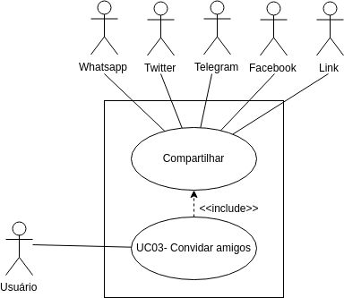

| Data       | Versão  | Descrição       | Autor            |
| ---------- | ------- | --------------- | ---------------- |
| 24/04/2019 | [1.0](https://github.com/requisitos-2019-1/Ribon/commit/41b7168a0d6e55bf3f69553306aeb23406308271) | Criação do UC03 | Victor Rodrigues |
| 25/04/2019 | [1.1](https://github.com/requisitos-2019-1/Ribon/commit/3da08de2990b3bcf151534066fa539fb5c90e2b7) | Adicionando diagrama | Victor Rodrigues |

# UC03: Convidar amigos

## Diagramas
 Versão 1.

## 1. Descrição
O [Usuário](https://github.com/requisitos-2019-1/Ribon/blob/master/Modelagem%20de%20Requisitos/Lexicos/Usuário.md) deseja compartilhar o [Aplicativo](https://github.com/requisitos-2019-1/Ribon/blob/master/Modelagem%20de%20Requisitos/Lexicos/Aplicativo.md) com amigos.

## 2. Descrição dos atores

### 2.1. [Usuário](https://github.com/requisitos-2019-1/Ribon/blob/master/Modelagem%20de%20Requisitos/Lexicos/Usuário.md)
### 2.2. Amigo

## 3. Pré-condição
- [Usuário](https://github.com/requisitos-2019-1/Ribon/blob/master/Modelagem%20de%20Requisitos/Lexicos/Usuário.md) deve estar com [App](https://github.com/requisitos-2019-1/Ribon/blob/master/Modelagem%20de%20Requisitos/Lexicos/Aplicativo.md) aberto.

## 4. Fluxo básico de eventos
1. O caso de uso começa quando o [Usuário](https://github.com/requisitos-2019-1/Ribon/blob/master/Modelagem%20de%20Requisitos/Lexicos/Usuário.md) abre o [App](https://github.com/requisitos-2019-1/Ribon/blob/master/Modelagem%20de%20Requisitos/Lexicos/Aplicativo.md).
2. [Usuário](https://github.com/requisitos-2019-1/Ribon/blob/master/Modelagem%20de%20Requisitos/Lexicos/Usuário.md) é apresentado a tela de [História](https://github.com/requisitos-2019-1/Ribon/blob/master/Modelagem%20de%20Requisitos/Lexicos/Historia.md)s.
3. [Usuário](https://github.com/requisitos-2019-1/Ribon/blob/master/Modelagem%20de%20Requisitos/Lexicos/Usuário.md) seleciona aba "Perfil".
4. [Usuário](https://github.com/requisitos-2019-1/Ribon/blob/master/Modelagem%20de%20Requisitos/Lexicos/Usuário.md) seleciona botão "Convide amigos"
5. [Usuário](https://github.com/requisitos-2019-1/Ribon/blob/master/Modelagem%20de%20Requisitos/Lexicos/Usuário.md) é apresentado a 5 opções de compartilhamento.
6. [Usuário](https://github.com/requisitos-2019-1/Ribon/blob/master/Modelagem%20de%20Requisitos/Lexicos/Usuário.md) seleciona o metodo de compartilhamento desejado.
7. [Usuário](https://github.com/requisitos-2019-1/Ribon/blob/master/Modelagem%20de%20Requisitos/Lexicos/Usuário.md) compartilha o [Aplicativo](https://github.com/requisitos-2019-1/Ribon/blob/master/Modelagem%20de%20Requisitos/Lexicos/Aplicativo.md).
8. O caso de uso termina.

## 5. Fluxo alternativo
Não possui.

## 6. Cenário chave

- [Cenário 003 - Convidar amigos](https://github.com/requisitos-2019-1/Ribon/blob/master/Modelagem%20de%20Requisitos/Cenarios/Convidar_amigos.md)

## 7. Pós-condição
- [Usuário](https://github.com/requisitos-2019-1/Ribon/blob/master/Modelagem%20de%20Requisitos/Lexicos/Usuário.md) recebe 500 [Ribon](https://github.com/requisitos-2019-1/Ribon/blob/master/Modelagem%20de%20Requisitos/Lexicos/Ribon.md)s, caso algum amigo utiliza o [Aplicativo](https://github.com/requisitos-2019-1/Ribon/blob/master/Modelagem%20de%20Requisitos/Lexicos/Aplicativo.md) atravéz do compartilhamento.
