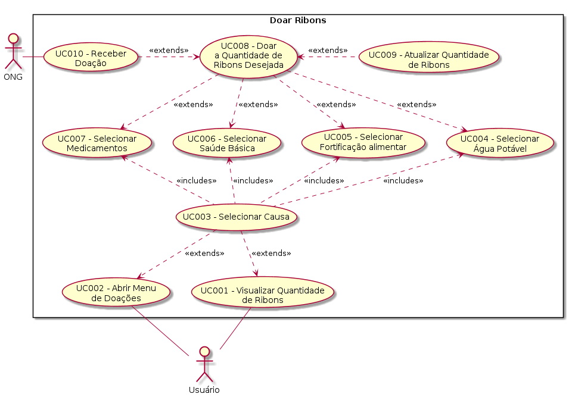

| Data       | Versão  | Descrição       | Autor            |
| ---------- | ------- | --------------- | ---------------- |
| 27/04/2019 | [1.0](https://github.com/requisitos-2019-1/Ribon/commit/6b1347bf4e0f5150c9028dd87ac3d11453156d2a#diff-4981ba7f4161c4314c2a2c72f38f31e2) | Adicionando caso  | Guilherme de Lyra |
| 19/06/2019 | 1.1 | Adicionando Requisitos | Henrique Martins |

# [UC005](https://github.com/requisitos-2019-1/Ribon/blob/master/Modelagem%20de%20Requisitos/Cenarios/Doar_Fortifica%C3%A7%C3%A3o_alimentar.md) - Selecionar [Fortificação alimentar](https://github.com/requisitos-2019-1/Ribon/blob/master/Modelagem%20de%20Requisitos/Lexicos/LX013_Fortificacao_alimentar.md)

Versão 1.0.

# Breve Descrição
Através do Menu Doações, o [Usuário](https://github.com/requisitos-2019-1/Ribon/blob/master/Modelagem%20de%20Requisitos/Lexicos/LX031_Usuário.md) decide selecionar o [Card](https://github.com/requisitos-2019-1/Ribon/blob/master/Modelagem%20de%20Requisitos/Lexicos/LX004_Card.md) de [Fortificação alimentar](https://github.com/requisitos-2019-1/Ribon/blob/master/Modelagem%20de%20Requisitos/Lexicos/LX013_Fortificacao_alimentar.md).

# Principal(is) Ator(es)
[Usuário](https://github.com/requisitos-2019-1/Ribon/blob/master/Modelagem%20de%20Requisitos/Lexicos/LX031_Usuário.md)

# Pre-condições
1. Nenhuma.

# Fluxo básico de eventos
1. O [Usuário](https://github.com/requisitos-2019-1/Ribon/blob/master/Modelagem%20de%20Requisitos/Lexicos/LX031_Usuário.md) realiza o caso "UC003 - Selecionar [Causa](https://github.com/requisitos-2019-1/Ribon/blob/master/Modelagem%20de%20Requisitos/Lexicos/LX005_Causa.md)"
1. O [Usuário](https://github.com/requisitos-2019-1/Ribon/blob/master/Modelagem%20de%20Requisitos/Lexicos/LX031_Usuário.md) seleciona o [Card](https://github.com/requisitos-2019-1/Ribon/blob/master/Modelagem%20de%20Requisitos/Lexicos/LX004_Card.md) de [Fortificação alimentar](https://github.com/requisitos-2019-1/Ribon/blob/master/Modelagem%20de%20Requisitos/Lexicos/LX013_Fortificacao_alimentar.md).
1. O caso de uso termina.

# Pós-condições
1. [Usuário](https://github.com/requisitos-2019-1/Ribon/blob/master/Modelagem%20de%20Requisitos/Lexicos/LX031_Usuário.md) deve poder visualizar as [Causa](https://github.com/requisitos-2019-1/Ribon/blob/master/Modelagem%20de%20Requisitos/Lexicos/LX005_Causa.md)s disponíveis para [Doação](https://github.com/requisitos-2019-1/Ribon/blob/master/Modelagem%20de%20Requisitos/Lexicos/LX011_Doação.md).

# Requisitos

- [RF09](https://github.com/requisitos-2019-1/Ribon/blob/master/Requisitos/Requisitos_Funcionais.md#RF09)