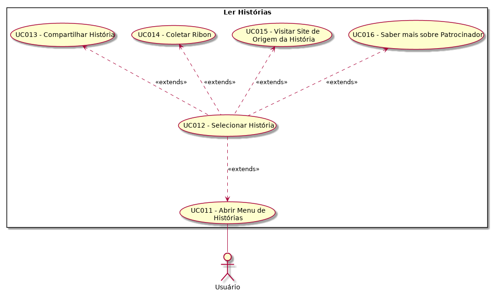

| Data       | Versão  | Descrição       | Autor            |
| ---------- | ------- | --------------- | ---------------- |
| 28/4/2019 | 1.0 | Adicionando caso | Henrique Martins |
| 29/4/2019 | 1.1 | Complementando fluxo | Guilherme de Lyra |

# [UC011](https://github.com/requisitos-2019-1/Ribon/blob/master/Modelagem%20de%20Requisitos/Cenarios/Ler_Historias.md) - Abrir Menu de [História](https://github.com/requisitos-2019-1/Ribon/blob/master/Modelagem%20de%20Requisitos/Lexicos/Historia.md)s

Versão 1.0.

# Breve Descrição
Abrindo o [Aplicativo](https://github.com/requisitos-2019-1/Ribon/blob/master/Modelagem%20de%20Requisitos/Lexicos/Aplicativo.md), ou através do botão [História](https://github.com/requisitos-2019-1/Ribon/blob/master/Modelagem%20de%20Requisitos/Lexicos/Historia.md)s, o [Usuário](https://github.com/requisitos-2019-1/Ribon/blob/master/Modelagem%20de%20Requisitos/Lexicos/Usuário.md) abre menu de [História](https://github.com/requisitos-2019-1/Ribon/blob/master/Modelagem%20de%20Requisitos/Lexicos/Historia.md)s.

# Principal(is) Ator(es)
[Usuário](https://github.com/requisitos-2019-1/Ribon/blob/master/Modelagem%20de%20Requisitos/Lexicos/Usuário.md)

# Pre-condições
1. Nenhuma.

# Fluxo básico de eventos
1. O caso se inicia quando o [Usuário](https://github.com/requisitos-2019-1/Ribon/blob/master/Modelagem%20de%20Requisitos/Lexicos/Usuário.md) inicia o [Aplicativo](https://github.com/requisitos-2019-1/Ribon/blob/master/Modelagem%20de%20Requisitos/Lexicos/Aplicativo.md), ou então, quando o [Usuário](https://github.com/requisitos-2019-1/Ribon/blob/master/Modelagem%20de%20Requisitos/Lexicos/Usuário.md) está em um menu diferente do Menu Principal (de [História](https://github.com/requisitos-2019-1/Ribon/blob/master/Modelagem%20de%20Requisitos/Lexicos/Historia.md)s) e seleciona o botão [História](https://github.com/requisitos-2019-1/Ribon/blob/master/Modelagem%20de%20Requisitos/Lexicos/Historia.md)s.
1. O [Usuário](https://github.com/requisitos-2019-1/Ribon/blob/master/Modelagem%20de%20Requisitos/Lexicos/Usuário.md) é direcionado ao menu de [História](https://github.com/requisitos-2019-1/Ribon/blob/master/Modelagem%20de%20Requisitos/Lexicos/Historia.md)s com sucesso.
1. O caso de uso termina.

# Pós-condições
1. [Usuário](https://github.com/requisitos-2019-1/Ribon/blob/master/Modelagem%20de%20Requisitos/Lexicos/Usuário.md) deve poder visualizar as [História](https://github.com/requisitos-2019-1/Ribon/blob/master/Modelagem%20de%20Requisitos/Lexicos/Historia.md)s inspiradoras (tenham sido elas coletadas ou não).
