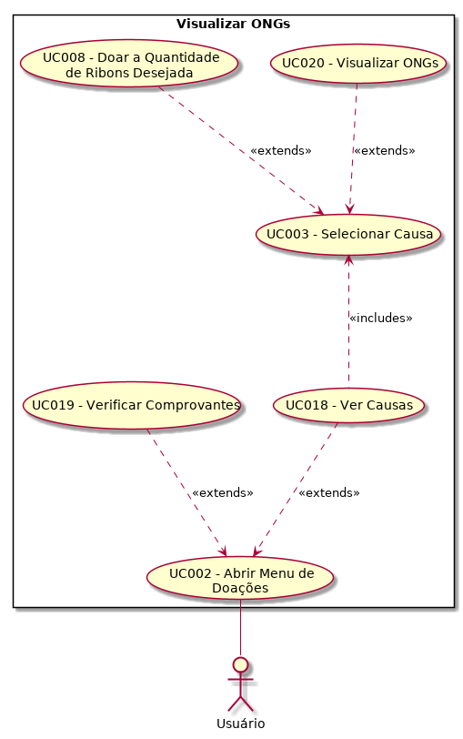

| Data       | Versão  | Descrição       | Autor            |
| ---------- | ------- | --------------- | ---------------- |
| 28/4/2019 | [1.0](https://github.com/requisitos-2019-1/Ribon/commit/cb1de9f3d807ba21598fba82598a6f0330745382#diff-14dd3fbf30c00483fd9dbd03b183882d) | Adicionando caso | Henrique Martins |

# UC020 - Visualizar [ONG](https://github.com/requisitos-2019-1/Ribon/blob/master/Modelagem%%20de%%20Requisitos/Lexicos/Ong.md)s

Versão 1.0.

# Breve Descrição
[Usuário](https://github.com/requisitos-2019-1/Ribon/blob/master/Modelagem%%20de%%20Requisitos/Lexicos/Usuário.md) pode visualizar as [ONG](https://github.com/requisitos-2019-1/Ribon/blob/master/Modelagem%%20de%%20Requisitos/Lexicos/Ong.md)s disponíveis e suas informações

# Principal(is) Ator(es)
[Usuário](https://github.com/requisitos-2019-1/Ribon/blob/master/Modelagem%%20de%%20Requisitos/Lexicos/Usuário.md)

# Pre-condições
1. Nenhuma.

# Fluxo básico de eventos
1. O [Usuário](https://github.com/requisitos-2019-1/Ribon/blob/master/Modelagem%%20de%%20Requisitos/Lexicos/Usuário.md) realiza o caso "UC003 - Selecionar [Causa](https://github.com/requisitos-2019-1/Ribon/blob/master/Modelagem%%20de%%20Requisitos/Lexicos/Causa.md)"
1. O [Usuário](https://github.com/requisitos-2019-1/Ribon/blob/master/Modelagem%%20de%%20Requisitos/Lexicos/Usuário.md) vislumbra diante de si as informações da [ONG](https://github.com/requisitos-2019-1/Ribon/blob/master/Modelagem%%20de%%20Requisitos/Lexicos/Ong.md).
1. O caso de uso termina.

# Pós-condições
1. [Usuário](https://github.com/requisitos-2019-1/Ribon/blob/master/Modelagem%%20de%%20Requisitos/Lexicos/Usuário.md) deve ter sido informado sobre as [ONG](https://github.com/requisitos-2019-1/Ribon/blob/master/Modelagem%%20de%%20Requisitos/Lexicos/Ong.md)s e suas ações
