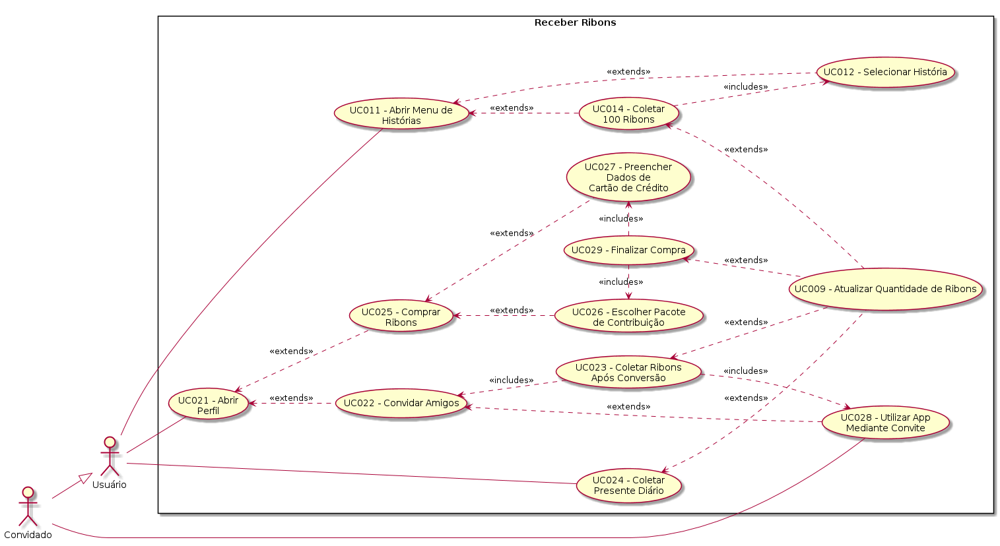

| Data       | Versão  | Descrição       | Autor            |
| ---------- | ------- | --------------- | ---------------- |
| 29/04/2019 | 1.0 | Adicionando caso | Guilherme de Lyra |
| 19/06/2019 | 1.1 | Adicionando Requisitos | Henrique Martins |
| 23/06/2019 | 1.2 | Arrumando Erros | Henrique Martins |

# [UC022](https://github.com/requisitos-2019-1/Ribon/blob/master/Modelagem%20de%20Requisitos/Cenarios/Convidar_amigos.md) - Convidar Amigos

Versão 1.0.

# Breve Descrição
Após abrir o perfil, o [Usuário](https://github.com/requisitos-2019-1/Ribon/blob/master/Modelagem%20de%20Requisitos/Lexicos/LX031_Usuário.md) convida amigos (através do Telegram, Whats[App](https://github.com/requisitos-2019-1/Ribon/blob/master/Modelagem%20de%20Requisitos/Lexicos/LX002_Aplicativo.md) etc) para utilizarem o [Aplicativo](https://github.com/requisitos-2019-1/Ribon/blob/master/Modelagem%20de%20Requisitos/Lexicos/LX002_Aplicativo.md), também.

# Principal(is) Ator(es)
[Usuário](https://github.com/requisitos-2019-1/Ribon/blob/master/Modelagem%20de%20Requisitos/Lexicos/LX031_Usuário.md)

# Pre-condições (incluindo trigger)
Nenhuma.

# Fluxo básico de eventos
1. O caso se inicia quando o [Usuário](https://github.com/requisitos-2019-1/Ribon/blob/master/Modelagem%20de%20Requisitos/Lexicos/LX031_Usuário.md) realiza o caso "UC021 - Abrir Perfil".
1. O [Usuário](https://github.com/requisitos-2019-1/Ribon/blob/master/Modelagem%20de%20Requisitos/Lexicos/LX031_Usuário.md) seleciona o "Convide amigos" ou "Compartilhar".
1. O caso de uso termina.

# Garantias/Pós-condições (o que deve ser verdade apos o final do caso de uso)
1. Acaso algum dos convidados venha a utilizar o [Aplicativo](https://github.com/requisitos-2019-1/Ribon/blob/master/Modelagem%20de%20Requisitos/Lexicos/LX002_Aplicativo.md), o [Usuário](https://github.com/requisitos-2019-1/Ribon/blob/master/Modelagem%20de%20Requisitos/Lexicos/LX031_Usuário.md) deve ser bonificado com 500 [Ribon](https://github.com/requisitos-2019-1/Ribon/blob/master/Modelagem%20de%20Requisitos/Lexicos/LX026_Ribon.md)s, realizando o caso "UC023 - [Coletar](https://github.com/requisitos-2019-1/Ribon/blob/master/Modelagem%20de%20Requisitos/Lexicos/LX006_Coletar.md) [Ribon](https://github.com/requisitos-2019-1/Ribon/blob/master/Modelagem%20de%20Requisitos/Lexicos/LX026_Ribon.md)s Após Conversão".
1. Acaso algum dos convidados venha a utilizar o [Aplicativo](https://github.com/requisitos-2019-1/Ribon/blob/master/Modelagem%20de%20Requisitos/Lexicos/LX002_Aplicativo.md), o convidado deve ser bonificado com 200 [Ribon](https://github.com/requisitos-2019-1/Ribon/blob/master/Modelagem%20de%20Requisitos/Lexicos/LX026_Ribon.md)s, realizando o caso "UC023 - [Coletar](https://github.com/requisitos-2019-1/Ribon/blob/master/Modelagem%20de%20Requisitos/Lexicos/LX006_Coletar.md) [Ribon](https://github.com/requisitos-2019-1/Ribon/blob/master/Modelagem%20de%20Requisitos/Lexicos/LX026_Ribon.md)s Após Conversão".

# Requisitos

- [RF42](https://github.com/requisitos-2019-1/Ribon/blob/master/Requisitos/Requisitos_Funcionais.md#RF42)