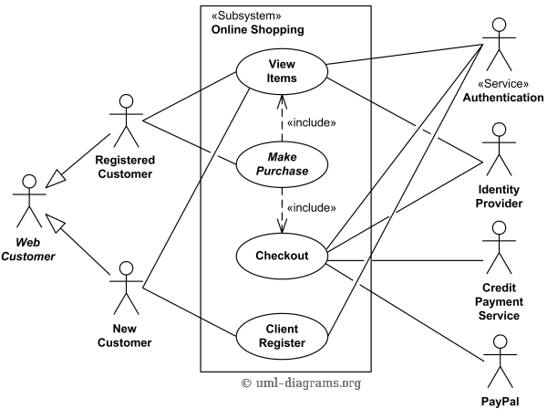

| Data       | Versão  | Descrição         | Autor            |
| ---------- | ------- | ----------------- | ---------------- |
| 24/04/2019 | [1.0]() | Criação do modelo | Victor Rodrigues |

# UCXX: Nome do caso de uso

## 1. Descrição
Breve descrição do caso de uso

## 2. Descrição dos atores

### 2.1. Nome do ator
Descrição

## 3. Pré-condição
Pré condição

## 4. Fluxo básico de eventos
1. The use case begins when < actor>, < does something>…
2. < fluco básico: passo 1>
3. … 
4. < fluxo básico: passo n>
5. O caso de uso termina.

## 5. Fluxos alternativos

### 5.1 Fluxo alternativo 1
Se no passo < x > do fluxo básico o < ator ou sistema faz algo>, que:
1. < descreva o fluxo > 
2. O caso de uso continua no passo < y >

## 6. Cenário chave

## 7. Pós-condição

### 7.1 <Pós condição 1>
