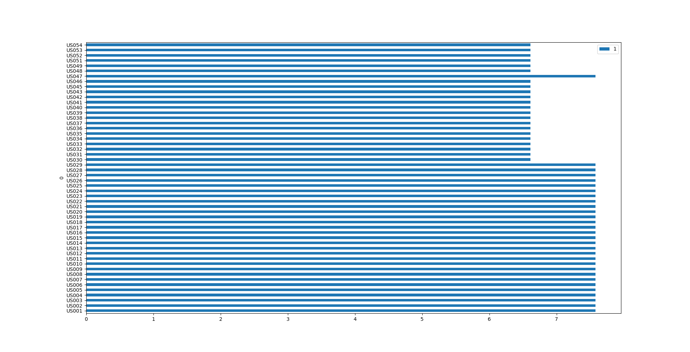

| Data | Versão | Descrição | Autor |
| - | - | - | - |
| 31/05/2019 | 1.0 | Template Inicial | Henrique Martins |
| 04/06/2019 | 1.1 | Respondendo as perguntas | Henrique Martins |
| 04/06/2019 | 1.2 | Verificando Qualidade das histórias de usuário | Henrique Martins |
| 05/06/2019 | 1.3 | Incrementando template com impacto de perguntas e Resultados numéricos | Guilherme de Lyra |
| 05/06/2019 | 1.4 | Incrementando template com contexto, justificativa e tipo (para perguntas) tabela de relevâncias tabela de validação geral e adição de bibliografia | Guilherme de Lyra |
| 07/06/2019 | 1.5 | Adição de Impactos, Justificativas e Tipos | Henrique Martins, Victor Rodrigues |

# Verificação - Inspeção [Backlog de Produto](https://github.com/requisitos-2019-1/Ribon/wiki/Backlog-de-Produto)
## Questões Avaliadoras
<!-- questao -->
| Questão | Impacto | Justificativa do Impacto | Tipo |
| ------- | :-----: | :-----------: | :-- |
| 1 - A história é separada por tema? | Alto | Para haver diferença clara entre Funcional e Não-Funcional | Binário |
| 2 - A história está em um único padrão de escrita? | Alto | Padronizar ajuda no entendimento dos casos de uso | Numérico |
| 3 - A história apresenta épico? | Alto | O épico clissifica melhor os casos de uso e ajuda no entendimento | Binário | 
| 4 - A história apresenta features? | Baixo | Ajuda na identificação do caso de uso na aplicação | Binário | 
| 5 - A história possui um ID de especificação enumerada em ordem crescente? | Médio  | A história possuir um ID único ajuda na visualização | Binário |
| 6 - A história é pontuada de acordo com a sequência de Fibonacci? | Baixo |  A pontuação só é usada para representar a possível dificuldade de implementação do caso de uso | Binário |
| 7 - A história é priorizada pelo modelo MoSCoW? | Alto |  Representa a importância do caso de uso na aplicação | Binário |
| 8 - A descrição do tema e épico da história são coerentes? | Baixo  | Uma descrição detalhadas destes componentes ajuda na compreensão dos casos de uso | Numérico |
| 9 - A Sprint dessa história está pontuado? | Baixo | A pontuação ajuda na compreensão da complexidade do caso de uso | Binário | 
| 10 - A história especifica ao menos 1 critério de aceitação? | Alto  | Auxilia no entendimento do objetivo da história de usuário | Numérico |
| 11 - A história identifica o usuário principal? | Alto  | Auxilia na identificação do ator envolvido na história | Binário |
| 12 - A história apresenta um ou mais links dos seus respectivos rastreamentos? | Baixo  | Acrescenta maior praticidade na rastreabilidade | Numérico |
| 13 - "O que” e o “para que” estão definidos na descrição da história? | Alto |  São elementos de extrema importância para a confecção das histórias de usuário | Binário |
| 14 - "O que” e o “para que” estão coerentes? | Alto  | São elementos de extrema importância para o entendimento das histórias de usuário | Numérico |
<!-- fquestao -->
## Auditorias Realizadas

* [Inspeção - Henrique Martins](https://github.com/requisitos-2019-1/Ribon/blob/master/Verificacao/inspecoes/henrique-martins/inspecao_backlog.md)

## Consenso das Avaliações
<!-- inicio -->
| Backlog de Produto | 1 | 2 | 3 | 4 | 5 | 6 | 7 | 8 | 9 | 10 | 11 | 12 | 13 | 14 |
| ---- | - | - | - | - | - | - | - | - | - | - | - | - | - | - |
| US001 | &#10003; | 10 | X | X | &#10003; | X | &#10003; | 5 | X | 10 | &#10003; | 0 | &#10003; | 10 |  
| US002 | &#10003; | 10 | X | X | &#10003; | X | &#10003; | 5 | X | 10 | &#10003; | 0 | &#10003; | 10 |  
| US003 | &#10003; | 10 | X | X | &#10003; | X | &#10003; | 5 | X | 10 | &#10003; | 0 | &#10003; | 10 |  
| US004 | &#10003; | 10 | X | X | &#10003; | X | &#10003; | 5 | X | 10 | &#10003; | 0 | &#10003; | 10 |  
| US005 | &#10003; | 10 | X | X | &#10003; | X | &#10003; | 5 | X | 10 | &#10003; | 0 | &#10003; | 10 |  
| US006 | &#10003; | 10 | X | X | &#10003; | X | &#10003; | 5 | X | 10 | &#10003; | 0 | &#10003; | 10 |  
| US007 | &#10003; | 10 | X | X | &#10003; | X | &#10003; | 5 | X | 10 | &#10003; | 0 | &#10003; | 10 |  
| US008 | &#10003; | 10 | X | X | &#10003; | X | &#10003; | 5 | X | 10 | &#10003; | 0 | &#10003; | 10 |  
| US009 | &#10003; | 10 | X | X | &#10003; | X | &#10003; | 5 | X | 10 | &#10003; | 0 | &#10003; | 10 |
| US010 | &#10003; | 10 | X | X | &#10003; | X | &#10003; | 5 | X | 10 | &#10003; | 0 | &#10003; | 10 |
| US011 | &#10003; | 10 | X | X | &#10003; | X | &#10003; | 5 | X | 10 | &#10003; | 0 | &#10003; | 10 |
| US012 | &#10003; | 10 | X | X | &#10003; | X | &#10003; | 5 | X | 10 | &#10003; | 0 | &#10003; | 10 |
| US013 | &#10003; | 10 | X | X | &#10003; | X | &#10003; | 5 | X | 10 | &#10003; | 0 | &#10003; | 10 |
| US014 | &#10003; | 10 | X | X | &#10003; | X | &#10003; | 5 | X | 10 | &#10003; | 0 | &#10003; | 10 |
| US015 | &#10003; | 10 | X | X | &#10003; | X | &#10003; | 5 | X | 10 | &#10003; | 0 | &#10003; | 10 |
| US016 | &#10003; | 10 | X | X | &#10003; | X | &#10003; | 5 | X | 10 | &#10003; | 0 | &#10003; | 10 |
| US017 | &#10003; | 10 | X | X | &#10003; | X | &#10003; | 5 | X | 10 | &#10003; | 0 | &#10003; | 10 |
| US018 | &#10003; | 10 | X | X | &#10003; | X | &#10003; | 5 | X | 10 | &#10003; | 0 | &#10003; | 10 |
| US019 | &#10003; | 10 | X | X | &#10003; | X | &#10003; | 5 | X | 10 | &#10003; | 0 | &#10003; | 10 |
| US020 | &#10003; | 10 | X | X | &#10003; | X | &#10003; | 5 | X | 10 | &#10003; | 0 | &#10003; | 10 |
| US021 | &#10003; | 10 | X | X | &#10003; | X | &#10003; | 5 | X | 10 | &#10003; | 0 | &#10003; | 10 |
| US022 | &#10003; | 10 | X | X | &#10003; | X | &#10003; | 5 | X | 10 | &#10003; | 0 | &#10003; | 10 |
| US023 | &#10003; | 10 | X | X | &#10003; | X | &#10003; | 5 | X | 10 | &#10003; | 0 | &#10003; | 10 |
| US024 | &#10003; | 10 | X | X | &#10003; | X | &#10003; | 5 | X | 10 | &#10003; | 0 | &#10003; | 10 |
| US025 | &#10003; | 10 | X | X | &#10003; | X | &#10003; | 5 | X | 10 | &#10003; | 0 | &#10003; | 10 |
| US026 | &#10003; | 10 | X | X | &#10003; | X | &#10003; | 5 | X | 10 | &#10003; | 0 | &#10003; | 10 |
| US027 | &#10003; | 10 | X | X | &#10003; | X | &#10003; | 5 | X | 10 | &#10003; | 0 | &#10003; | 10 |
| US028 | &#10003; | 10 | X | X | &#10003; | X | &#10003; | 5 | X | 10 | &#10003; | 0 | &#10003; | 10 |
| US029 | &#10003; | 10 | X | X | &#10003; | X | &#10003; | 5 | X | 10 | &#10003; | 0 | &#10003; | 10 |
| US030 | &#10003; | 10 | X | X | &#10003; | X | &#10003; | 5 | X | 0 | &#10003; | 0 | &#10003; | 10 |
| US031 | &#10003; | 10 | X | X | &#10003; | X | &#10003; | 5 | X | 0 | &#10003; | 0 | &#10003; | 10 |
| US032 | &#10003; | 10 | X | X | &#10003; | X | &#10003; | 5 | X | 0 | &#10003; | 0 | &#10003; | 10 |
| US033 | &#10003; | 10 | X | X | &#10003; | X | &#10003; | 5 | X | 0 | &#10003; | 0 | &#10003; | 10 |
| US034 | &#10003; | 10 | X | X | &#10003; | X | &#10003; | 5 | X | 0 | &#10003; | 0 | &#10003; | 10 |
| US035 | &#10003; | 10 | X | X | &#10003; | X | &#10003; | 5 | X | 0 | &#10003; | 0 | &#10003; | 10 |
| US036 | &#10003; | 10 | X | X | &#10003; | X | &#10003; | 5 | X | 0 | &#10003; | 0 | &#10003; | 10 |
| US037 | &#10003; | 10 | X | X | &#10003; | X | &#10003; | 5 | X | 0 | &#10003; | 0 | &#10003; | 10 |
| US038 | &#10003; | 10 | X | X | &#10003; | X | &#10003; | 5 | X | 0 | &#10003; | 0 | &#10003; | 10 |
| US039 | &#10003; | 10 | X | X | &#10003; | X | &#10003; | 5 | X | 0 | &#10003; | 0 | &#10003; | 10 |
| US040 | &#10003; | 10 | X | X | &#10003; | X | &#10003; | 5 | X | 0 | &#10003; | 0 | &#10003; | 10 |
| US041 | &#10003; | 10 | X | X | &#10003; | X | &#10003; | 5 | X | 0 | &#10003; | 0 | &#10003; | 10 |
| US042 | &#10003; | 10 | X | X | &#10003; | X | &#10003; | 5 | X | 0 | &#10003; | 0 | &#10003; | 10 |
| US043 | &#10003; | 10 | X | X | &#10003; | X | &#10003; | 5 | X | 0 | &#10003; | 0 | &#10003; | 10 |
| US045 | &#10003; | 10 | X | X | &#10003; | X | &#10003; | 5 | X | 0 | &#10003; | 0 | &#10003; | 10 |
| US046 | &#10003; | 10 | X | X | &#10003; | X | &#10003; | 5 | X | 0 | &#10003; | 0 | &#10003; | 10 |
| US047 | &#10003; | 10 | X | X | &#10003; | X | &#10003; | 5 | X | 10 | &#10003; | 0 | &#10003; | 10 |
| US048 | &#10003; | 10 | X | X | &#10003; | X | &#10003; | 5 | X | 0 | &#10003; | 0 | &#10003; | 10 |
| US049 | &#10003; | 10 | X | X | &#10003; | X | &#10003; | 5 | X | 0 | &#10003; | 0 | &#10003; | 10 |
| US051 | &#10003; | 10 | X | X | &#10003; | X | &#10003; | 5 | X | 0 | &#10003; | 0 | &#10003; | 10 |
| US052 | &#10003; | 10 | X | X | &#10003; | X | &#10003; | 5 | X | 0 | &#10003; | 0 | &#10003; | 10 |
| US053 | &#10003; | 10 | X | X | &#10003; | X | &#10003; | 5 | X | 0 | &#10003; | 0 | &#10003; | 10 |
| US054 | &#10003; | 10 | X | X | &#10003; | X | &#10003; | 5 | X | 0 | &#10003; | 0 | &#10003; | 10 |
<!-- fim -->
[Justificativas das Avaliações (Consenso)](https://github.com/requisitos-2019-1/Ribon/blob/master/Verificacao/inspecoes/henrique-martins/inspecao_backlog.md)
  
## Números:																																														
|   | Resultado |
| - | :---------: |
| Número de backlogs: | |
| Total de indicadores (Backlogs X Perguntas): |	|
| Taxa de erro de perguntas  (Σ Erros / Total de indicadores): |	 |

## Léxicos importantes identificados:
- [Aplicativo](https://github.com/requisitos-2019-1/Ribon/blob/master/Modelagem%20de%20Requisitos/Lexicos/LX002_Aplicativo.md)
- [Patrocinador](https://github.com/requisitos-2019-1/Ribon/blob/master/Modelagem%20de%20Requisitos/Lexicos/LX020_Patrocinador.md)
- [Ribon](https://github.com/requisitos-2019-1/Ribon/blob/master/Modelagem%20de%20Requisitos/Lexicos/LX026_Ribon.md)
- [Usuário](https://github.com/requisitos-2019-1/Ribon/blob/master/Modelagem%20de%20Requisitos/Lexicos/LX031_Usu%C3%A1rio.md)

## Validação Geral:
| Artefato | Nota Geral | Menção | Resultado |
| -------- | :--------: | :----: | :-------: |
| US001 |  7.580645 | MS |  Aprovado |
| US002 |  7.580645 | MS |  Aprovado |
| US003 |  7.580645 | MS |  Aprovado |
| US004 |  7.580645 | MS |  Aprovado |
| US005 |  7.580645 | MS |  Aprovado |
| US006 |  7.580645 | MS |  Aprovado |
| US007 |  7.580645 | MS |  Aprovado |
| US008 |  7.580645 | MS |  Aprovado |
| US009 |  7.580645 | MS |  Aprovado |
| US010 |  7.580645 | MS |  Aprovado |
| US011 |  7.580645 | MS |  Aprovado |
| US012 |  7.580645 | MS |  Aprovado |
| US013 |  7.580645 | MS |  Aprovado |
| US014 |  7.580645 | MS |  Aprovado |
| US015 |  7.580645 | MS |  Aprovado |
| US016 |  7.580645 | MS |  Aprovado |
| US017 |  7.580645 | MS |  Aprovado |
| US018 |  7.580645 | MS |  Aprovado |
| US019 |  7.580645 | MS |  Aprovado |
| US020 |  7.580645 | MS |  Aprovado |
| US021 |  7.580645 | MS |  Aprovado |
| US022 |  7.580645 | MS |  Aprovado |
| US023 |  7.580645 | MS |  Aprovado |
| US024 |  7.580645 | MS |  Aprovado |
| US025 |  7.580645 | MS |  Aprovado |
| US026 |  7.580645 | MS |  Aprovado |
| US027 |  7.580645 | MS |  Aprovado |
| US028 |  7.580645 | MS |  Aprovado |
| US029 |  7.580645 | MS |  Aprovado |
| US030 |  6.612903 | MM |  Aprovado |
| US031 |  6.612903 | MM |  Aprovado |
| US032 |  6.612903 | MM |  Aprovado |
| US033 |  6.612903 | MM |  Aprovado |
| US034 |  6.612903 | MM |  Aprovado |
| US035 |  6.612903 | MM |  Aprovado |
| US036 |  6.612903 | MM |  Aprovado |
| US037 |  6.612903 | MM |  Aprovado |
| US038 |  6.612903 | MM |  Aprovado |
| US039 |  6.612903 | MM |  Aprovado |
| US040 |  6.612903 | MM |  Aprovado |
| US041 |  6.612903 | MM |  Aprovado |
| US042 |  6.612903 | MM |  Aprovado |
| US043 |  6.612903 | MM |  Aprovado |
| US045 |  6.612903 | MM |  Aprovado |
| US046 |  6.612903 | MM |  Aprovado |
| US047 |  7.580645 | MS |  Aprovado |
| US048 |  6.612903 | MM |  Aprovado |
| US049 |  6.612903 | MM |  Aprovado |
| US051 |  6.612903 | MM |  Aprovado |
| US052 |  6.612903 | MM |  Aprovado |
| US053 |  6.612903 | MM |  Aprovado |
| US054 |  6.612903 | MM |  Aprovado |

## Bibliografia
> [[Requisitos - Aula 15 (Maurício Serrano e Milene Serrano)]](https://aprender.ead.unb.br/pluginfile.php/348662/mod_resource/content/5/Requisitos%20-%20Aula%2015a.pdf)
