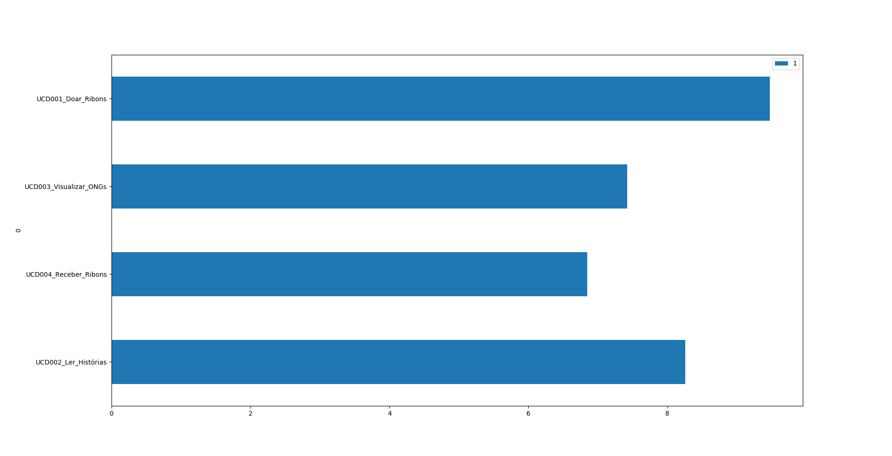

# Verificação - Inspeção [Diagrama dos Casos de Uso](https://github.com/requisitos-2019-1/Ribon/wiki/Casos-de-uso)

## Questões Avaliadoras

<!-- questao -->
| Questão | Impacto | Justificativa do Impacto | Tipo |
| ------- | :-----: | :----------------------: | :-- |
| 1 - O nome do ator revela seu papel no sistema? | Alto | Como é um modelo, é necessário que os elementos atendam esse modelo e sigam suas diretrizes | Binário |
| 2 - Os nomes dos casos de uso são construidas em voz ativa, e utilizam o tempo presente? | Alto | Regra do modelo | Binário |
| 3 - Quando ocorre relacionamentos entre casos de usos, estes relacionamentos são: Relacionamento de Inclusão, Relacionamento de Extensão, Relacionamento de Generalização? | Alto | Regra do modelo | Binário |
| 4 - No diagrama, ao menos um caso de uso se relaciona com um ator? | Alto | Regra do modelo | Binário |
| 5 - Nos relacionamentos de inclusão, o caso base é incompleto sem o caso que está sendo incluído? | Alto | Regra do Modelo | Binário |
| 6 - Nos relacionamentos de extensão, o caso extendido (ou, caso base) é completo por si só? | Alto | Regra do modelo | Binário |
| 7 - Nos relacionamentos de generalização, este é usado para funcionalidades que foram re-usadas? | Alto | Regra do modelo | Binário |
| 8 - Possui descrição dos atores? | Baixo | Informações extras que possam ajudar a elucidar são bem-quistas | Binário |
| 9 - Os termos passiveis de mais de uma interpretação constam em glossário, com clara definição? | Alto | Auxilia no entendimento, sendo, portanto, uma boa prática necessária - | Numérico |
| 10 - Os nomes dos casos de uso procuram ser objetivas, evitando redundâncias ou presença de informações evidentemente desnecessárias? | Baixo | Boa prática | Numérico |
| 11 - O diagrama possui entre 6 a 10 passos no fluxo normal? | Médio | Resulta em mais clareza, sem perder informações e sem adicionar informações desnecessárias | Numérico |
| 12 - Cada passo do diagrama é/mostra uma ação? | Alto | Regra do Modelo | Binário |
| 13 - O diagrama possui fluxo principal? | Alto | O objetivo, num documento completo, é que se haja no mínimo 3 cenários (podendo-se [estender para até 5](https://hientl.files.wordpress.com/2011/12/tnyc_discovering-require.pdf), página 120): <li>O caminho padrão para se atingir o objetivo</li><li>Fluxos alternativos</li><li>Fluxos de exceção (que podem ou não ser recuperados)</li> Sendo assim, não é exatamente uma regra do modelo, mas uma boa prática necessária | Binário |
| 14 - O diagrama possui fluxo alternativo até o objetivo? | Alto | As mesmas ponderações acima. | Binário |
| 15 - O diagrama possui fluxos de exceção recuperáveis? | Alto | As mesmas ponderações acima. | Binário |
| 16 - O diagrama possui fluxos de exceção irrecuperáveis, mas que são tratados? | Alto | As mesmas ponderações acima. | Binário |
| 17 - O diagrama lista as exceções que não serão tratadas? | Alto | As mesmas ponderações acima. | Binário |
| 18 - As garantias pós-sucesso são fidedignas? | Alto | As mesmas ponderações acima. | Numérico |
| 19 - As garantias pós-falha são fidedignas? | Alto | As mesmas ponderações acima. | Numérico |
| 20 - Há uma tabela com possíveis requisitos não funcionais ligados ao diagrama? | Baixo | Pode-se retirar informações úteis dessa forma | Binário |
| 21 - A rastreabilidade está bem implementada? | Alto | É importante manter um acesso fácil aos termos-chaves, às origens e inspirações (baseadas em modelos anteriores) que levaram à construção do modelo analisado. | Numérico |
| 22 - Os nomes do casos de uso evitam termos condicionais (como "se" ou "mas")? | Alto | Deve-se sempre partir do pressuposto de que as condicionais foram cumpridas | Binário |
<!-- fquestao -->
## Auditorias Realizadas

* [Inspeção - Henrique Martins](https://github.com/requisitos-2019-1/Ribon/blob/master/Verificacao/inspecoes/henrique-martins/inspecao_diagrama_caso_de_uso.md)
* [Inspeção - Guilherme de Lyra](inspecoes/guilherme-de-lyra/inspecao_diagrama_caso_de_uso.md)

## Consenso das Avaliações
<!-- inicio -->
|Diagramas (Guilherme de Lyra)       |   1    |   3    |   4    |   5    |   6    |   7    |   8    | 9 |10 |11 |   12   |   2    |   14   |   13   |   16   |   17   |18 |19 |   20   |21 |   22   |   15   |
|----------------------|--------|--------|--------|--------|--------|--------|--------|--:|--:|--:|--------|--------|--------|--------|--------|--------|--:|--:|--------|--:|--------|-------- |
|UCD002_Ler_Histórias  |&#10003;|&#10003;|&#10003;|&#10003;|&#10003;|&#10003;|&#10003;| 10|  8|  4|&#10003;|&#10003;|X       |&#10003;|&#10003;|X       | 10| 10|&#10003;|  9|&#10003;|X       |
|UCD004_Receber_Ribons |&#10003;|&#10003;|&#10003;|&#10003;|&#10003;|&#10003;|X       |  9|  9|  9|&#10003;|&#10003;|&#10003;|&#10003;|X       |X       |  0|  0|&#10003;|  9|&#10003;|X       |
|UCD003_Visualizar_ONGs|&#10003;|&#10003;|&#10003;|&#10003;|&#10003;|&#10003;|X       |  9| 10| 10|&#10003;|&#10003;|&#10003;|&#10003;|X       |X       | 10|  0|&#10003;|  9|&#10003;|X       |
|UCD001_Doar_Ribons    |&#10003;|&#10003;|&#10003;|&#10003;|X       |&#10003;|&#10003;| 10| 10| 10|&#10003;|&#10003;|&#10003;|&#10003;|&#10003;|&#10003;| 10| 10|&#10003;|  9|&#10003;|&#10003;|
<!-- fim -->

[Justificativas das Avaliações (Consenso)](inspecoes/consenso/inspecao_diagrama_caso_de_uso.md)

## Números:																																														
|   | Resultado |
| - | :---------: |
| Número de casos de uso: | |
| Total de indicadores (Casos de Uso x Perguntas): | |
| Taxa de erro de perguntas  (Σ Erros / Total de indicadores): |	 |

## Léxicos importantes identificados:
- [Ribon](https://github.com/requisitos-2019-1/Ribon/blob/master/Modelagem%20de%20Requisitos/Lexicos/LX026_Ribon.md)
- [Causa](https://github.com/requisitos-2019-1/Ribon/blob/master/Modelagem%20de%20Requisitos/Lexicos/LX005_Causa.md)

## Validação Geral:
| Artefato | Nota Geral | Menção | Resultado |
| -------- | :--------: | :----: | :-------: |
| UCD002_Ler_Histórias    | 8.254237 |  MS | Aprovado |
| UCD004_Receber_Ribons   | 6.847458  | MM | Aprovado |
| UCD003_Visualizar_ONGs  | 7.423729  | MS | Aprovado |
| UCD001_Doar_Ribons      | 9.474576  | SS | Aprovado |

## Bibliografia:
> [Requisitos - Aula 07 (Maurício Serrano e Milene Serrano)](https://aprender.ead.unb.br/pluginfile.php/348648/mod_resource/content/3/Requisitos%20-%20Aula%2007.pdf)